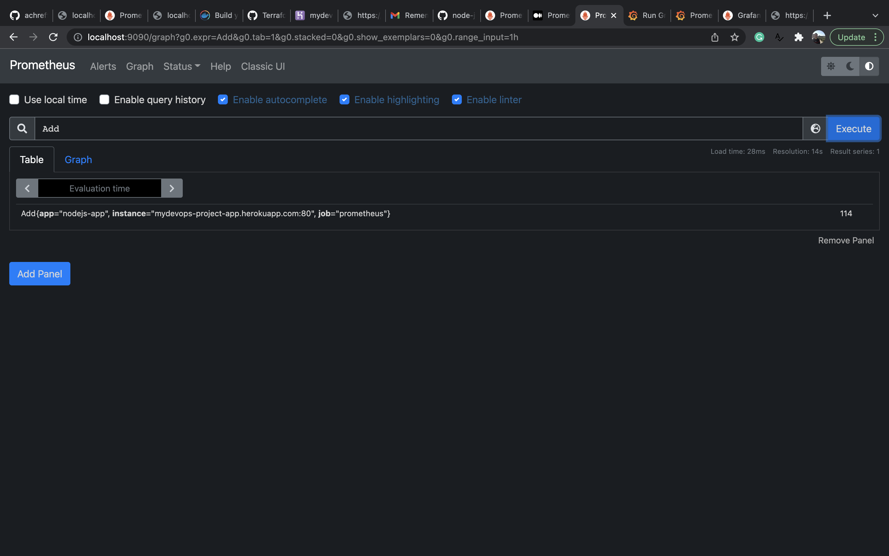
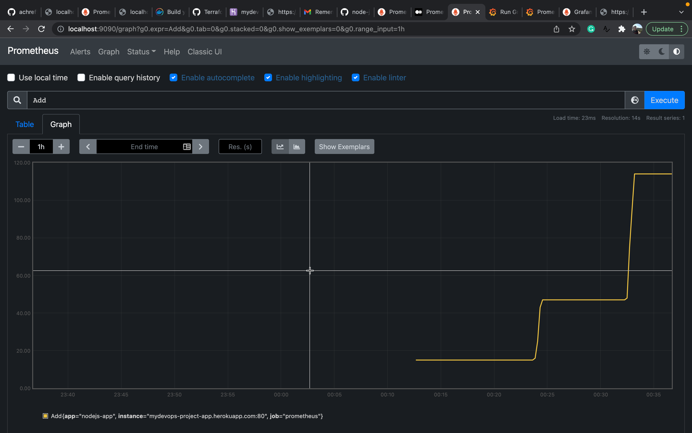
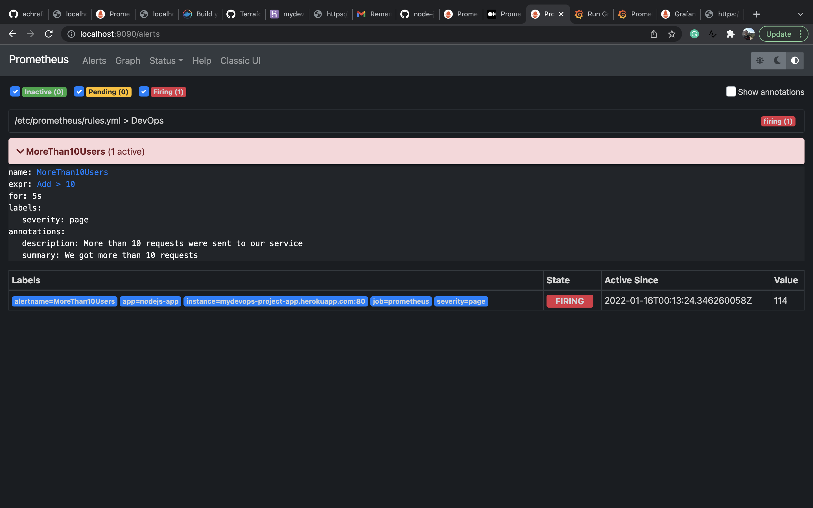
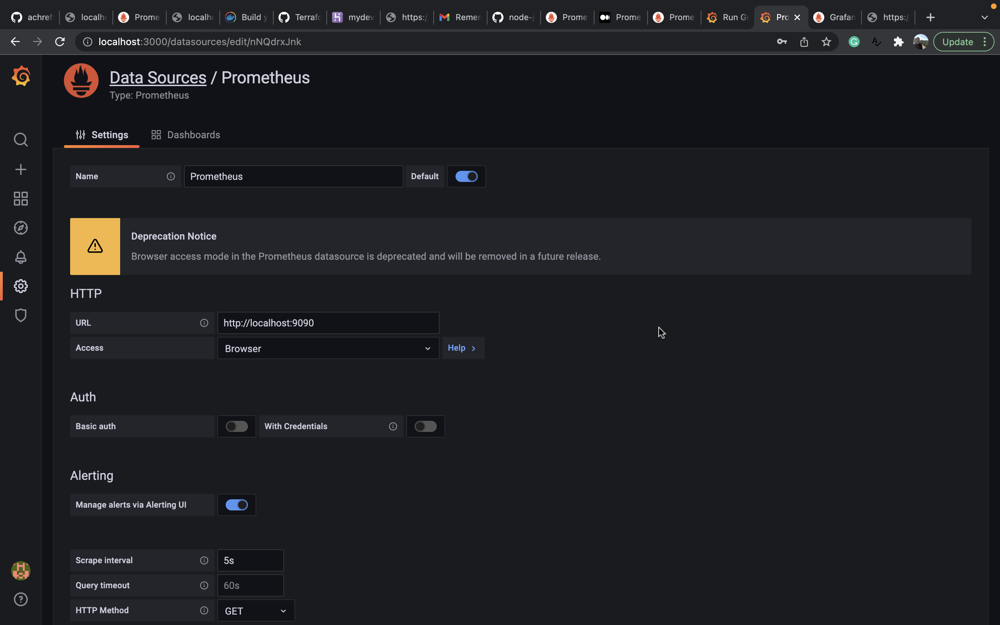
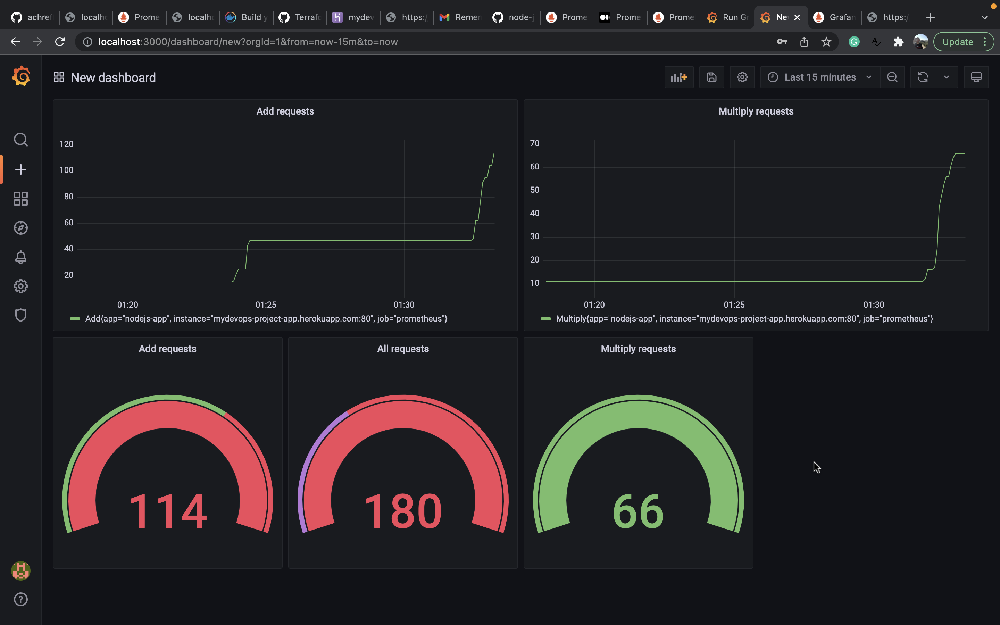

# DevopsProjApp

# Endpoint

 For local host 
```sh
http://localhost:5000/
```
 For Heroku host 
```sh
https://mydevops-project-app.herokuapp.com/
```

# APIs
## Home

end point 
```http
GET /
```

 Response example

```string
Home !!!
```

## Addition

end point 
```http
GET /add?n1=15&n2=5
```

 Response example

```json
15
```

## Multiplication

end point 
```http
GET /mult?n1=5&n2=10
```

 Response example

```json
50
```

## Metrics api

end point 
```http
GET /metrics
```

 Response example

```string
# HELP Add Number of add function calls
# TYPE Add gauge
Add{app="nodejs-app"} 2

# HELP Multiply Number of function calls
# TYPE Multiply gauge
Multiply{app="nodejs-app"} 3
```
# Prometheus

Promotheurs configuration file can be found under `/monitoring/prometheus.yaml`

Build and run Prometheus by running this command: 

```bash
docker build -t prom . 
docker run -p 9090:9090 prom 
```


## Prometheus Screenshots

Query: 



Graph: 



Alert:



# Grafana


We run Grafana using the official image: 

```bash
docker run -d -p 3000:3000 grafana/grafana-enterprise
```

We setup grafana Data Source to pull metrics from Prometheus. 



Then we create the dashboard. 




